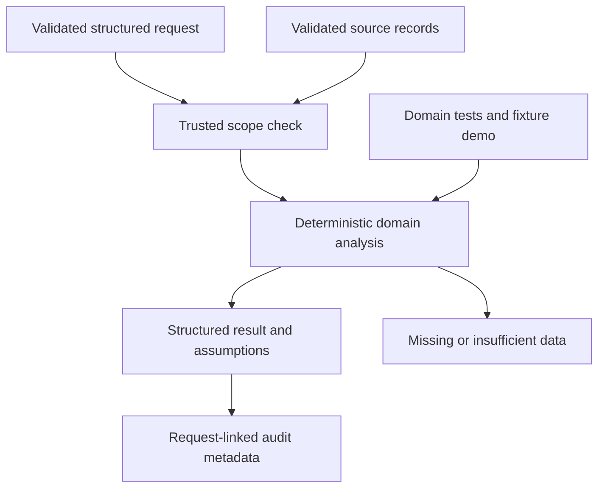

# M7 domain delta

Branch agent/customer-service, pinned foundation 77c8c9217fa45d9028fbe8ad1fb22c4ea53e3045. Evidence-grounded FAQ/policy excerpts, source metadata in AgentResult, validity/approval/store filters, content-hash checks, sentiment/complaint classification, domain handoff suggestions and explicit human escalation for absent or conflicting evidence. EvidenceRetriever protocol prepares later authorized RAG integration.

Interfaces: Query, validated domain records, evaluate(records, query), Agent(BaseAgent).

Local lexical evidence adapter only; ChromaDB integration is intentionally deferred across isolated branches. No generated policy text. Distinct relevant documents conservatively trigger conflict review even when potentially compatible. Sentiment and coverage are English heuristics, not learned or calibrated scores. Hashes must come from a trusted manifest and are unkeyed; stronger trust belongs to Security. No ticket is sent or created.

29 nodes and 34 edges in JSON. 30 tests passed. Remote savepoint: 1714eb47e8693df39774aa4ecd7f98afbc93d404. Official completion 84%. No master graph updates, shared delta or branch integration.
