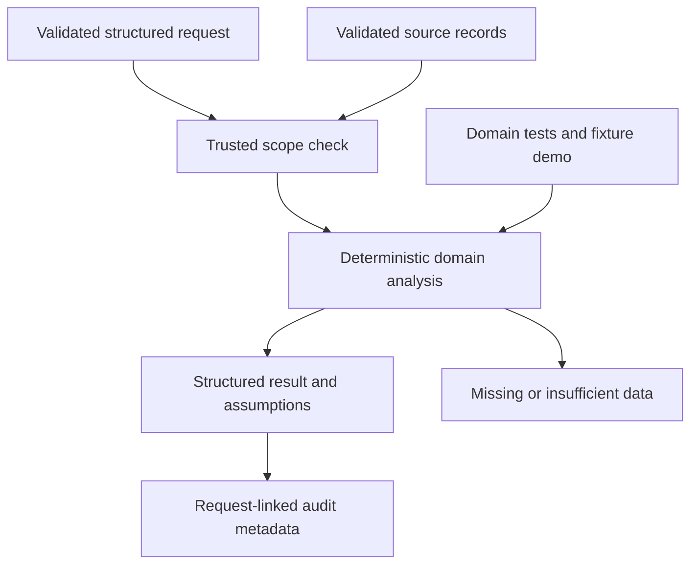

# M9 domain delta

Branch agent/demand-forecasting, pinned foundation 77c8c9217fa45d9028fbe8ad1fb22c4ea53e3045. Store/SKU daily moving-average and exponential-smoothing forecasts, contiguous-history checks, trend change, weekday aggregates after 28 days, rolling one-step residual evaluation, heuristic uncertainty bands and BayesianEstimator extension protocol.

Interfaces: Query, validated domain records, evaluate(records, query), Agent(BaseAgent).

Missing calendar dates are not filled as zero sales; stale or insufficient history returns insufficient_evidence. Future records are excluded. Forecasts are level baselines; weekday aggregates are descriptive, not a fitted seasonal model. Intervals use residual RMSE and sqrt(horizon), are not calibrated, and remain null without evaluation residuals. No promotion covariates, Bayesian posterior, forecast accuracy claim or production connector.

26 nodes and 31 edges in JSON. 26 tests passed. Remote savepoint: 96ee693724effd96ccad34fab2defcb762f9e8c4. Official completion 48%. No master graph updates, shared delta or branch integration.
