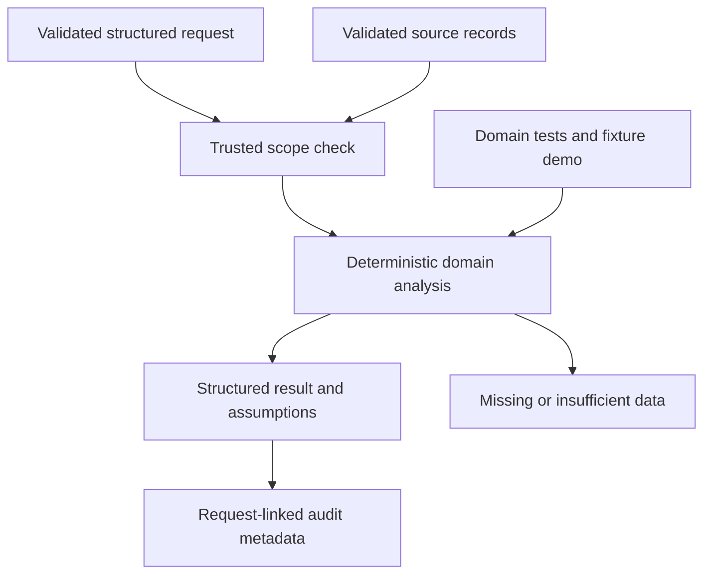

# M3 domain delta

Branch agent/inventory, pinned foundation 77c8c9217fa45d9028fbe8ad1fb22c4ea53e3045. Latest-as-of stock snapshots, low stock, reorder-point comparison, lead-time stockout risk, safety stock, inventory position, reorder quantities, net stock movement, overstock, store/SKU filters and cross-store totals. AllocationStrategy and BayesianDemandStrategy protocols prepare future multi-echelon/game-theory extensions.

Interfaces: Query, validated domain records, evaluate(records, query), Agent(BaseAgent).

Safety stock assumes independent daily demand and fixed lead time: z*sigma*sqrt(lead days). Demand-based target covers lead+review days. Missing demand produces null risk/quantity; missing variability is warned and omitted. On-order timing is unknown and not used to claim immediate availability. Explicit as_of and age_days expose snapshot staleness. Latest valid snapshot selected per store/SKU; duplicate dates rejected. No real-time connector, Bayesian solver or multi-echelon optimizer implemented.

33 nodes and 38 edges in JSON. 31 tests passed. Remote savepoint: d28f3016222311454fd7adeccb32b4c72d90eabe. Official completion 40%. No master graph updates, shared delta or branch integration.
