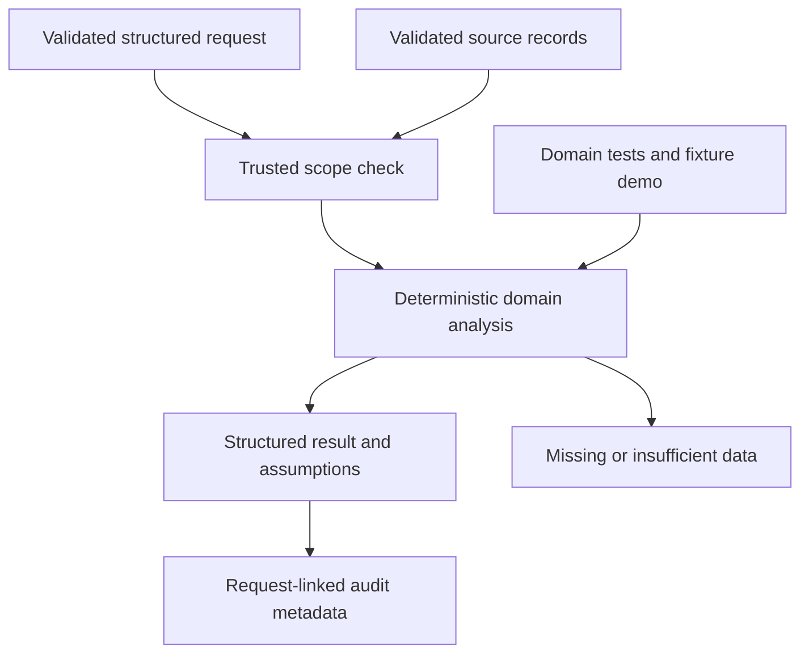

# M4 domain delta

Branch agent/order-fulfillment, pinned foundation 77c8c9217fa45d9028fbe8ad1fb22c4ea53e3045. Structured observed-order lookup, validated fulfillment state transitions and aware timestamps, shipping connector interface, SLA compliance and supplied-ETA risk flags, plus deadline/capacity-aware single-SKU split-allocation recommendations.

Interfaces: Query, validated domain records, evaluate(records, query), Agent(BaseAgent).

No real orders provided. Fixtures are explicit and unknown orders are never fabricated. Allocation minimizes additive variable unit cost among deadline-feasible supplied sources; it assumes divisible quantities and excludes fixed fees, multi-SKU coupling and live capacity reservations. Recommendations never update orders or shipments. Delay flags use observed deadline/ETA rules, not a trained predictor. Snapshot as_of filtering prevents future status leakage.

29 nodes and 33 edges in JSON. 30 tests passed. Remote savepoint: 1a28ffee72407a6937f8f43060668d2b08cc2939. Official completion 78%. No master graph updates, shared delta or branch integration.
