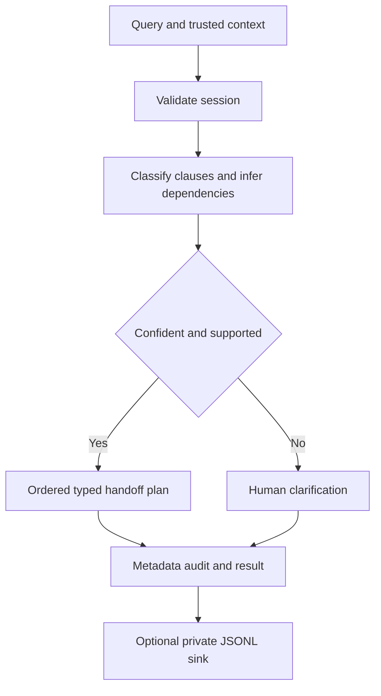

# M2 router delta

Base: foundation/core-platform at 77c8c9217fa45d9028fbe8ad1fb22c4ea53e3045. Global graphs remain inherited snapshots; this branch graph records implemented router code only.

LangGraph implements the conditional transition. No task is executed; no RAG or domain branch is integrated. Produced interfaces: RouterAgent, RoutingPlan, Task, Intent, RouteSettings and JsonlAuditSink. Foundation interfaces are consumed unchanged.

27 router cases plus 20 foundation cases pass. Demo covers inventory, multi-intent inventory/demand/pricing and escalation. Confidence is heuristic; real-world semantic accuracy remains unevaluated. Security/authorization, downstream invocation and aggregate answers are separate dependencies. No SHARED DELTA.

M2 PASS: published implementation 244d971d40c85cc5e0330dd2c88afd83e5dd1d1c verified. M0+M1+M11+M2 total 31%.
