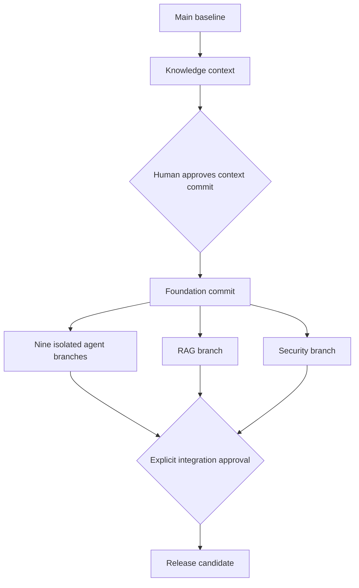

# Branch lineage

Remote main and context/project-knowledge exist. Context starts at c21658e55c96d7adc78b82d2e2f3d2b17d226144; M0 publication commit is 526b5bbe82e9ca06a64389e37d5cacb9b4a0eca7. All later branches remain planned.
