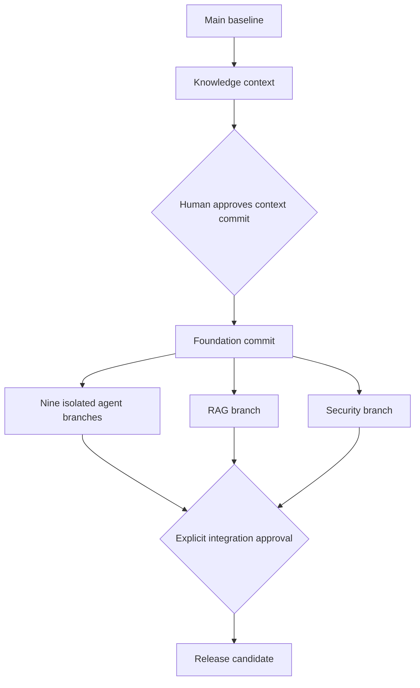

# Branch lineage

Only main is confirmed remotely. Local context branch starts at c21658e55c96d7adc78b82d2e2f3d2b17d226144. No remote development branch was created because the connector denied the write. All later branches remain planned.
