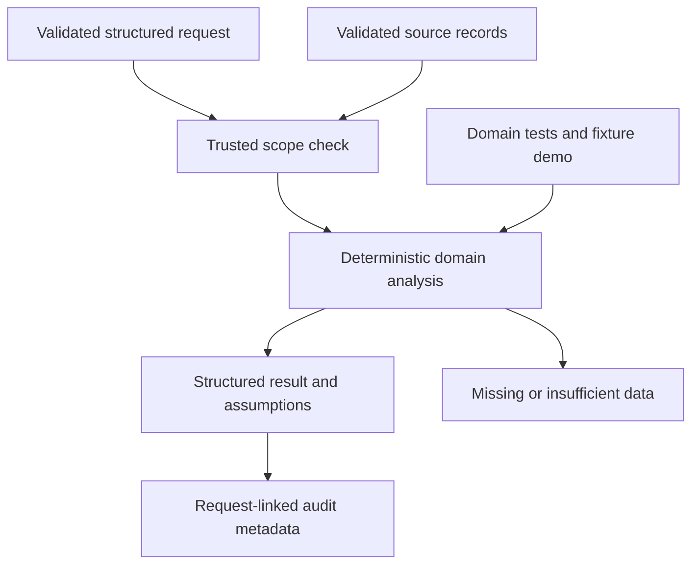

# M6 domain delta

Branch agent/pricing-promotions, pinned foundation 77c8c9217fa45d9028fbe8ad1fb22c4ea53e3045. Observed prices separated from advisory recommendations, dated promotion eligibility and stock-risk blocks, Decimal money arithmetic, margin floors, bounded price changes, scarcity rule using demand/forecast signals, sandbox competitor-undercut simulation and elasticity extension protocol.

Interfaces: Query, validated domain records, evaluate(records, query), Agent(BaseAgent).

No production price mutation or fitted elasticity. Competitor simulation is a bounded one-step undercut rule, not a solved Bertrand equilibrium. Observed competitor data is mandatory for that mode. Conflicting margin and price-change constraints abstain for human review. Recommendation age is explicit; no external price feed or live stock connector.

27 nodes and 31 edges in JSON. 28 tests passed. Remote savepoint: pending. Official completion 55%. No master graph updates, shared delta or branch integration.
