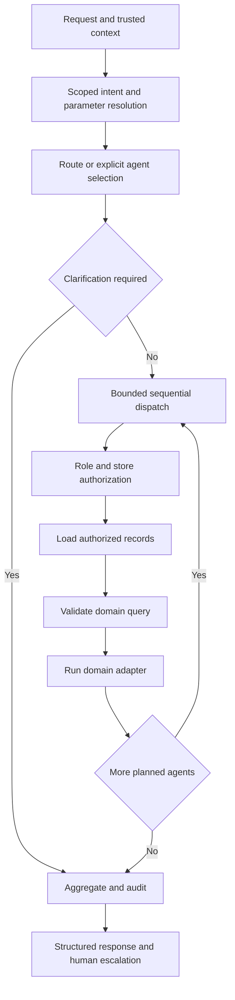
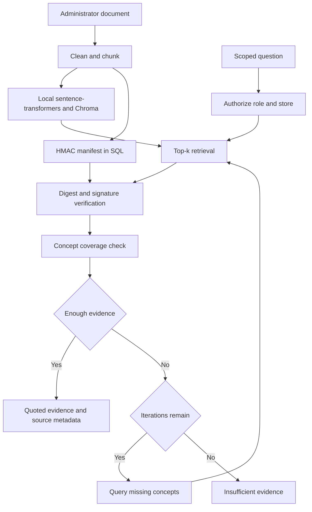
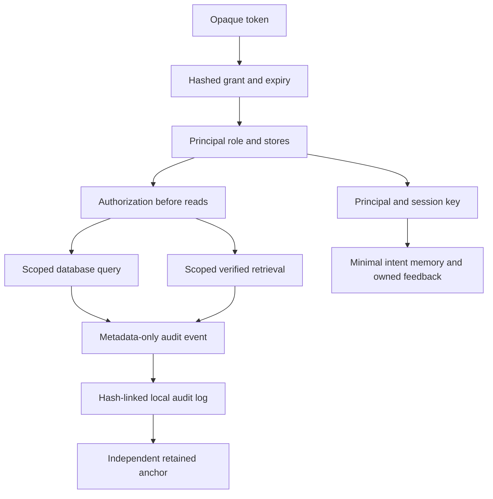
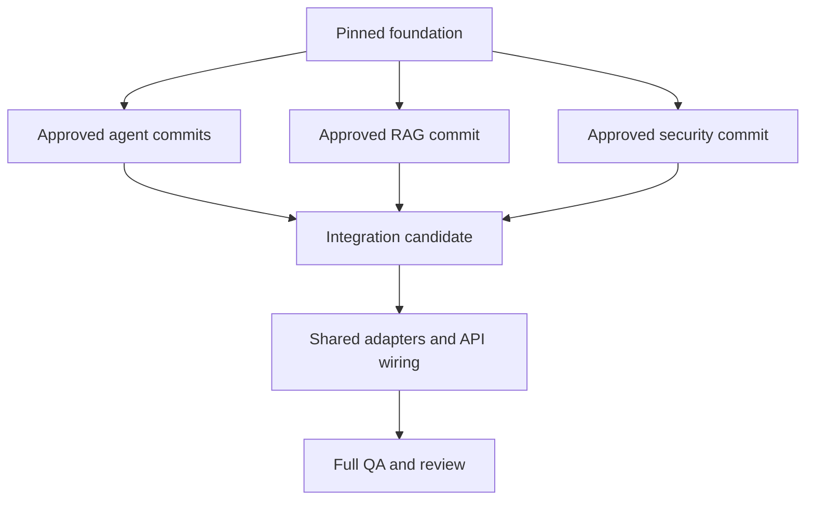
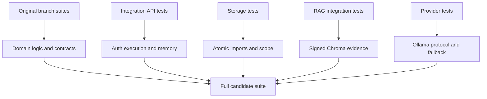

# Integrated knowledge graph

500 nodes / 786 edges. M13 INCOMPLETE; 95% weighted completion. See `docs/integration/REPORT.md` for validation and blockers. Source records are immutable under `docs/integration/sources/`; their milestone statements are historical.

# Integrated architecture

The human-approved candidate composes pinned source implementations without altering their source branches. Domain code remains byte-identical to the approved commits. Shared integration code lives in `app/integration`; changes to `app/main.py`, dependency installation, foundation route expectations and global documentation are the approved SHARED DELTA.

## System

```mermaid
flowchart TD
 client[Authenticated request] --> api[FastAPI schemas]
 api --> auth[Server-owned bearer grants]
 auth --> graph[LangGraph workflow]
 graph --> router[Router plan]
 router --> registry[Agent registry and scope gate]
 registry --> agents[Eight domain adapters]
 agents --> repo[Authorized SQL records]
 agents --> rag[Verified local evidence]
 repo --> aggregate[Results and conflict review]
 rag --> aggregate
 aggregate --> audit[Durable audit and receipt]
 audit --> response[Response with provenance]
```

The router maps intent to registry IDs; the registry maps IDs to source agent contracts and permissions. Database values are validated observations, not generated text. The registry supports inventory, orders, supply, pricing, customer service, returns, forecasting and analytics. Domain model constraints and assumptions remain authoritative.

## LangGraph and multi-agent flow



Maximum eight dispatches per request; no model-generated loops or unrestricted recursive handoffs. Later results record earlier result dependencies. Aggregation combines outputs and produces an inventory/forecast replenishment advisory when low stock and rising demand coexist. Discounts conflicting with stock risk escalate. It does not overwrite observed prices/stock with forecasts. `requires_other_agents` remains an advisory unless already in the explicit approved plan; missing handoff parameters require another query. Sentiment escalations do not send a ticket.

## Agentic RAG



`SignedRag` adapts the isolated RAG store to the security boundary. Signatures bind all chunk fields, not only text. Invalid/untrusted chunks never reach the coverage step. Manifests and keys require independently protected storage. No embedded instructions are executed. Pretrained semantic quality is an external evaluation task; the test model is lexical.

## Security and audit



API body roles are rejected. Store access is rechecked after memory lookup. Secrets/raw documents are not included in audit events. Auth/schema failures are sanitized HTTP metadata logs; requests entering orchestration produce durable status events unless the audit backend itself fails, in which case no successful response is returned. One process is required for this local writer; an operational append-only audit backend is future work.

## Provider and data lifecycle

SQLAlchemy transactions make imports all-or-nothing. CSV/XLSX mappings target existing domain schemas explicitly; fixture/source metadata comes from the importer. Tables remain empty until an operator imports data. SQLite is the development default; the repository uses SQLAlchemy for future database adaptation.

Ollama is optional for a separate unverified narrative draft. It receives only the already-produced answer and has no tools or authority. Core facts and escalation remain deterministic. Hosted Azure/OpenAI adapters and Azure deployment are extension work, not implemented services.

## Branch ownership



## Test relationships


