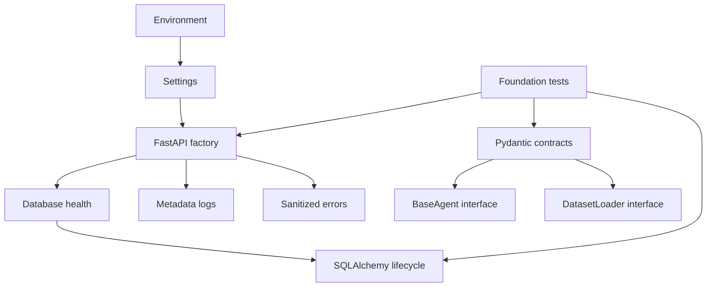

# M1 foundation delta

Approved base: 3cc1a8df36c49147daac2c3967f37020bb0f5654. Master/context graphs remain unchanged. Branch JSON provides file ownership, import and test relationships.

Implemented: validated configuration, API factory/lifespan, root/health, docs/OpenAPI, errors/logging, schemas, BaseAgent and data interfaces, transactional database lifecycle. Tests cover failures as well as normal inputs.

Only interfaces exist for DatasetLoader, RetailRepository and BaseAgent. No agent/RAG/business source integration. No production retail data. RequestContext is internal and must eventually come from trusted authentication; QueryRequest rejects role claims. AuditEvent is a schema only, with durable audit and integrity owned by later work.

New dependencies are justified in BRANCH_README.md. No cross-branch propagation or SHARED DELTA. Foundation implementation publication a9a8df42e84a7eff3950cee94b4a5a2760de0c4c verified with git ls-remote. M1 PASS earns 10%; M0 earned 5%; official completion 15%. Main and context unchanged.
