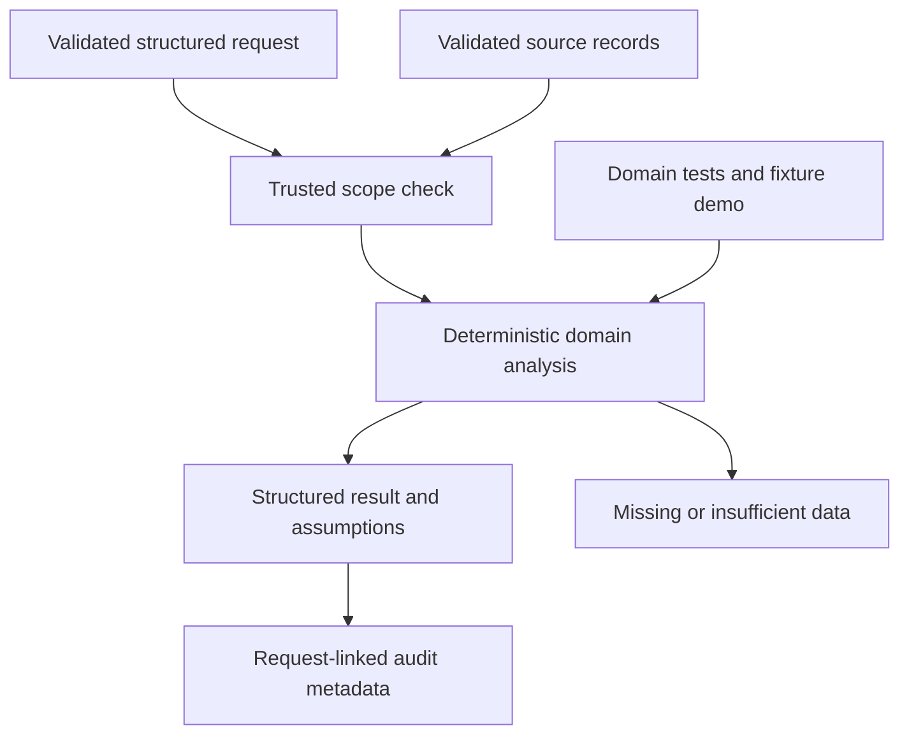

# M5 domain delta

Branch agent/supply-chain, pinned foundation 77c8c9217fa45d9028fbe8ad1fb22c4ea53e3045. Vendor/SKU lookup, observed lead-time analysis, historical late-delivery fraction, replenishment requirements and capacity shortfalls, vendor comparison, logistics metadata, attributed SOP excerpts, disruption scenarios, descriptive bargaining history and strategic-player/SOP retrieval extension protocols.

Interfaces: Query, validated domain records, evaluate(records, query), Agent(BaseAgent).

Uses only supplied records. Unknown lead-time history stays unknown; contractual lead time is labelled. Scenario multiplier is not a disruption prediction. Vendor ranking is single-source capacity then lead-time then price, not a global logistics optimizer. No repeated-game/Bayesian solver or negotiation automation. SOP text requires source attribution and is returned as evidence, not executed instructions.

31 nodes and 35 edges in JSON. 29 tests passed. Remote savepoint: pending. Official completion 63%. No master graph updates, shared delta or branch integration.
