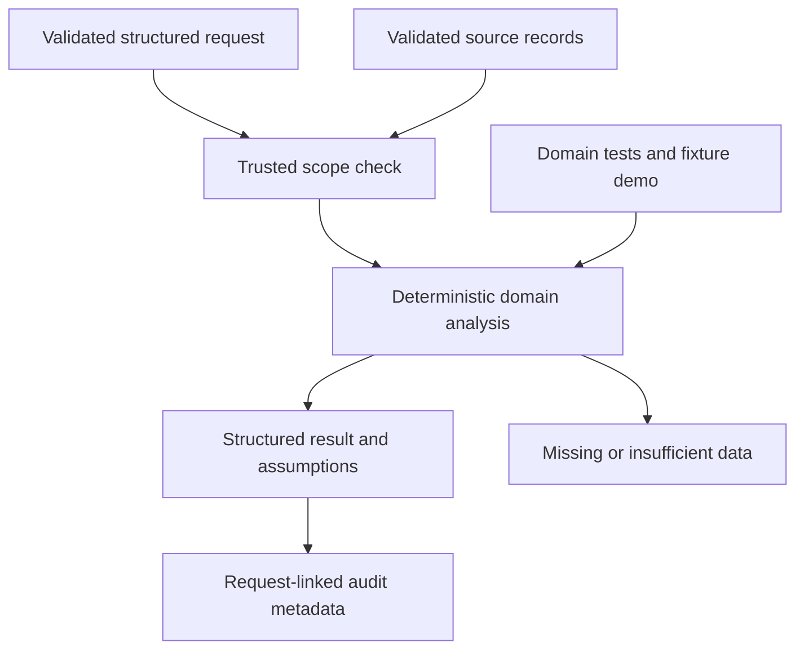

# M10 domain delta

Branch agent/analytics-reporting, pinned foundation 77c8c9217fa45d9028fbe8ad1fb22c4ea53e3045. Exact Decimal revenue and units totals, sales by store/category, top and slow-moving SKUs, latest per-store/SKU low-stock and stockout counts, explicit unknown risk count, observed inventory-turnover proxy, store comparison outputs, AuditEvent activity metrics and anomaly-detector extension protocol.

Interfaces: Query, validated domain records, evaluate(records, query), Agent(BaseAgent).

Input rows must be daily store/SKU aggregates with duplicates rejected. Revenue excludes unprovided tax/discount/refund adjustments. Turnover is a unit-based proxy over observed stock snapshots, not financial inventory turnover; missing days are not imputed. Audit metrics use full request latency, not isolated agent runtime. No trained anomaly detector, real operational data or dashboard/API integration.

28 nodes and 33 edges in JSON. 28 tests passed. Remote savepoint: pending. Official completion 48%. No master graph updates, shared delta or branch integration.
