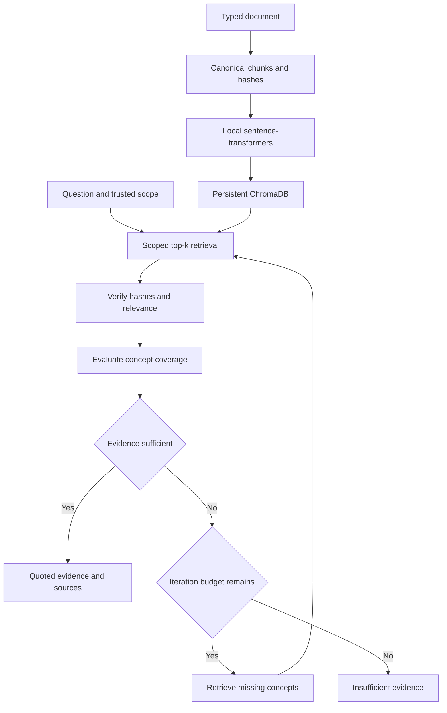

# M11 RAG branch delta

Pinned foundation: 77c8c9217fa45d9028fbe8ad1fb22c4ea53e3045. M0 master graph remains unchanged. Runtime and dependency details are in this branch README and machine-readable graph.

Implemented: ingestion, overlapping chunks, provenance hashes, CPU local embedding adapter, Chroma persistence, scope filter, relevance thresholds, bounded iterations, extractive result and fixture warnings. 13 real-store/local-model RAG tests and inherited 20 foundation tests pass. Offline demo verifies source evidence.

New interfaces: Document, Chunk, Hit, RagResult, RagSettings, Embedder, ChromaStore, RagPipeline. No modification to foundation interfaces. app/rag/requirements.txt owns additional dependencies. No shared delta or integration. Scope authorization and trusted hash storage remain security-branch dependencies.

Local baseline verified with a sentence-transformers BoW model. Semantic pretrained retrieval quality and production policies are unverified. Coverage is a heuristic and output is an evidence excerpt, not generative reasoning. Publication pending; M11 cannot earn its 8% until verified.
