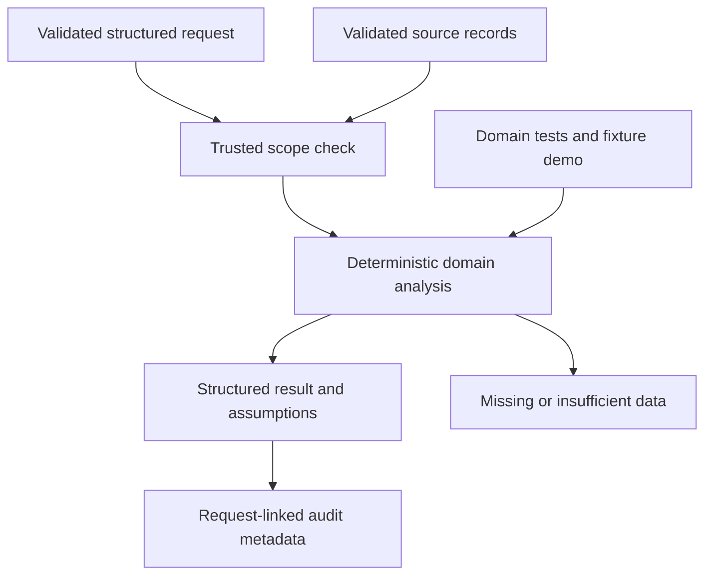

# M8 domain delta

Branch agent/returns-refunds, pinned foundation 77c8c9217fa45d9028fbe8ad1fb22c4ea53e3045. Supplied-policy return eligibility, inclusive return-window checks, receipt/condition/reason/quantity rules, observed refund lookup, capped advisory refund amount, return-reason taxonomy, manual-review risk flags and refund/fraud extension protocols.

Interfaces: Query, validated domain records, evaluate(records, query), Agent(BaseAgent).

No real returns or policies supplied. Policy absence yields insufficient evidence, and refund status is never invented. Amounts allocate payment equally per unit and are capped at unrefunded recorded payment; tax/fee allocation remains integration work. Receipt, condition and serial mismatch are reported inputs requiring verification. Risk thresholds are heuristic review flags, not trained fraud detection. No return, refund or financial transaction executed.

31 nodes and 35 edges in JSON. 29 tests passed. Remote savepoint: pending. Official completion 84%. No master graph updates, shared delta or branch integration.
