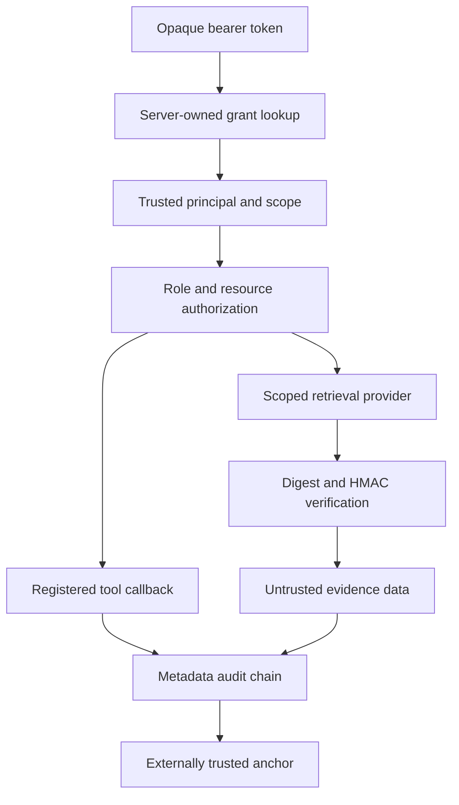

# M12 security delta

53 nodes / 69 edges. Foundation base 77c8c9217fa45d9028fbe8ad1fb22c4ea53e3045. 39 tests and demo passed. Savepoint publication-pending. Official completion 90%. Interfaces and limitations are in BRANCH_README.md. No source-branch integration or global graph mutation.
