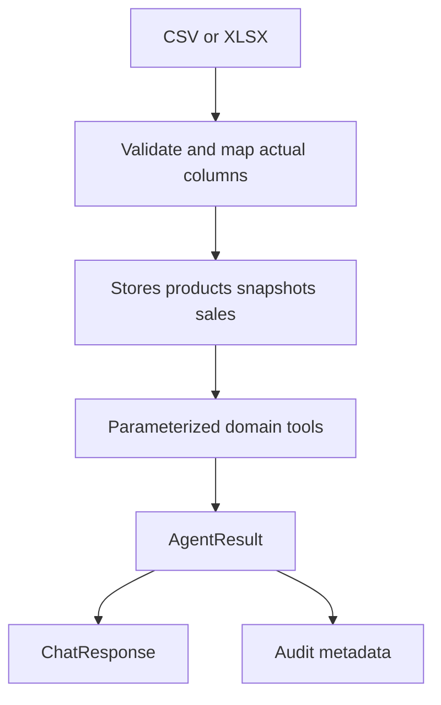

# Planned data flow

No source data is present. Infer no actual table columns. Validate dates, numerical values, duplicates, missing values, stock and identifiers at ingestion. SQLite through SQLAlchemy is a proposed local starting point; Azure deployment remains future work. Never expose development fixtures as real data.
