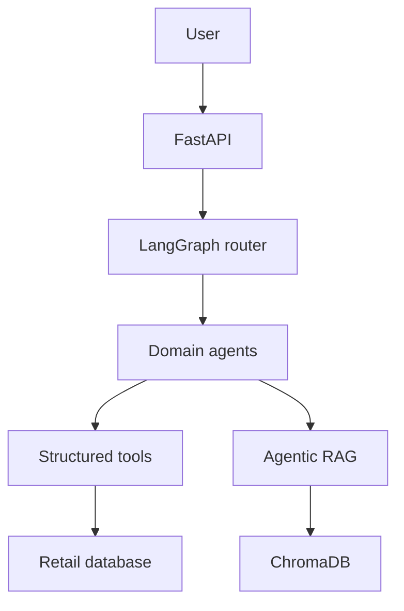
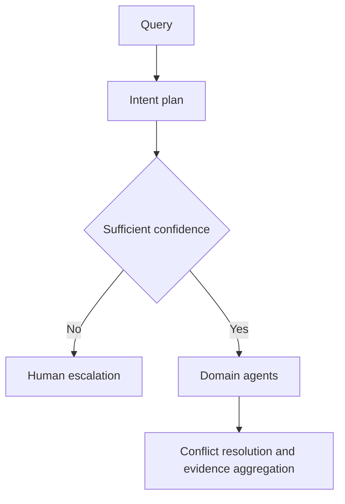
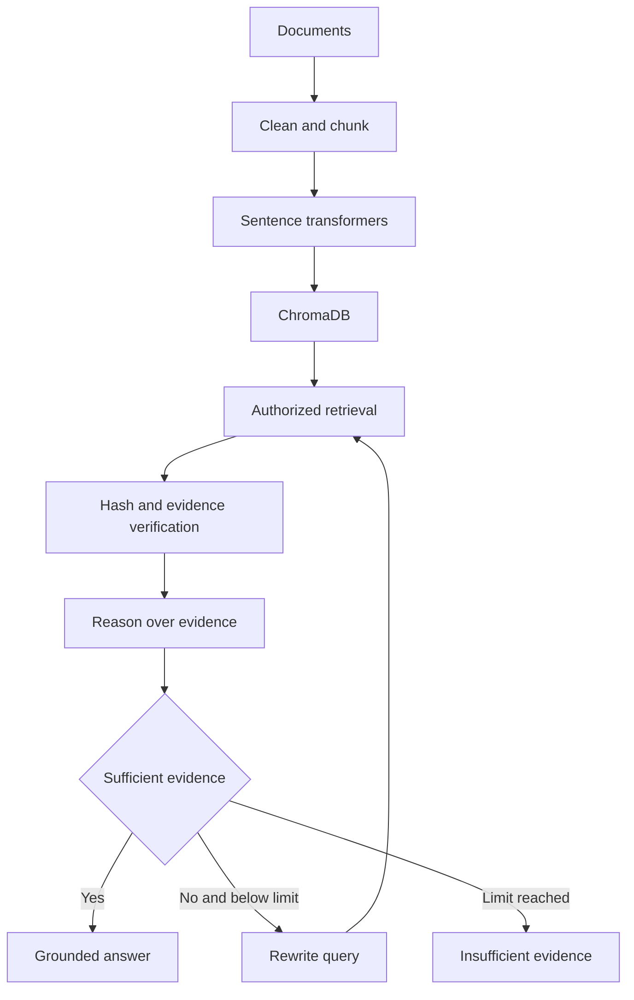
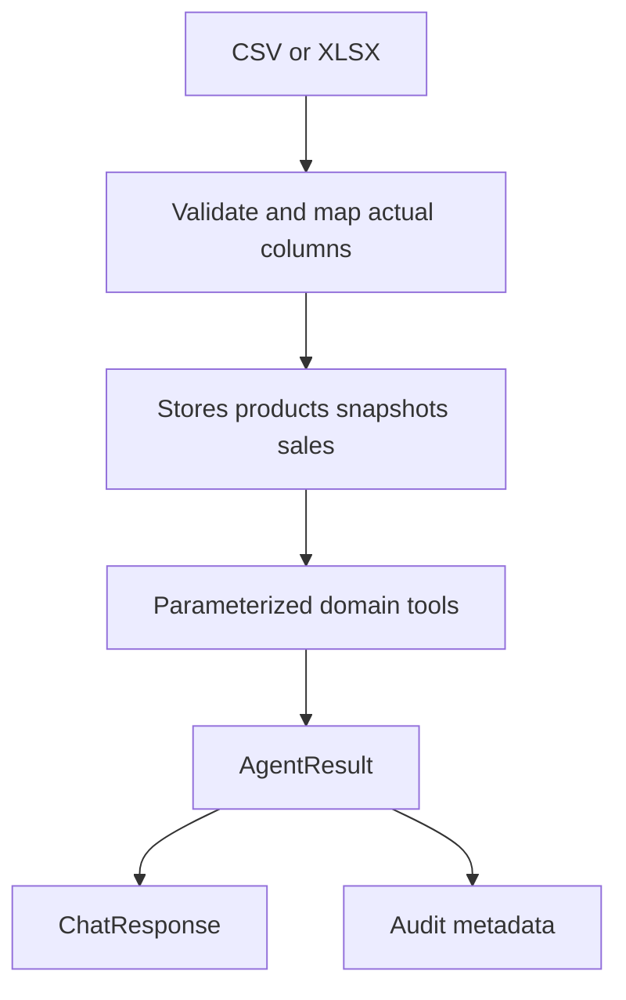
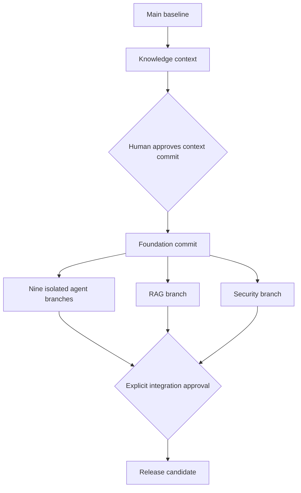
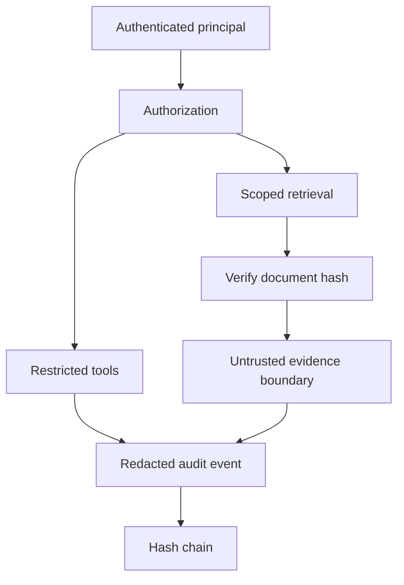
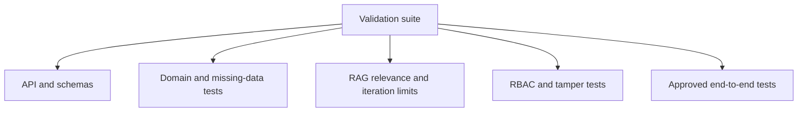

# Master knowledge graph

All diagrams describe the **planned** system; the baseline has no application code. Graph JSON distinguishes planned nodes from existing documentation.

## Overall architecture

## Multi-agent routing

## Agentic RAG

## Data flow

## Branch ownership

## Security and audit

## Test relationships

